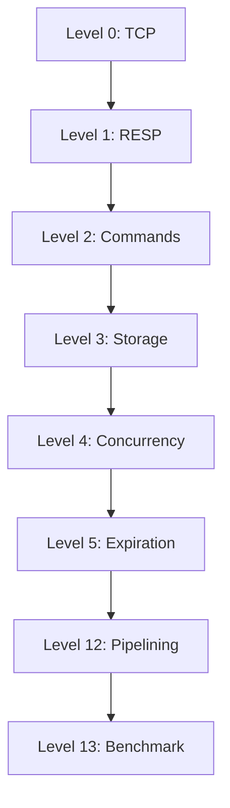

# Redis Clone Challenge

Build an in-memory key-value server in **Go** that speaks RESP over TCP — the wire protocol used by Redis.

**Duration:** 5 days × 4 hours/day (20 hours)  
**Language:** Go (standard library only)  
**Listen address:** `0.0.0.0:6379` (or configurable via flag/env)

---

## Objective

Implement a TCP server that speaks RESP and supports the commands defined below. Work through the levels in order. Each level adds requirements on top of the previous one.

You are done when **Levels 0–5 and 12** are fully satisfied. Level 13 is optional self-measurement.

Level numbers skip 6–11 intentionally; those slots are reserved for future topics (persistence, eviction, pub/sub, etc.) and are not part of this challenge.

---

## Progression

---

## Level 0 — TCP foundation

Accept and manage TCP connections.

**Requirements:**

- Listen on TCP port 6379
- Accept multiple clients over the lifetime of the process
- An idle connected client must not be disconnected by the server for at least several hundred milliseconds
- A client that disconnects must be able to connect again
- Multiple clients may connect sequentially; concurrent connects must not break the accept loop

**Not required yet:** parsing commands or sending application-level replies.

---

## Level 1 — RESP protocol

Parse the [Redis Serialization Protocol (RESP)](https://redis.io/docs/latest/develop/reference/protocol-spec/) and handle basic command flow.

**Requirements:**

- Parse commands encoded as RESP arrays of bulk strings
- Honor bulk string lengths exactly — read precisely N payload bytes, then `\r\n`; payloads may contain `\r`, `\n`, or `\0`
- `PING` → reply with `PONG` (simple string or bulk string)
- `PING <message>` → reply with the message as a bulk string
- Unknown command → `-ERR` reply with a meaningful message
- Malformed or incomplete RESP must not crash the process; new connections must still work
- Arbitrary non-RESP bytes on a connection must not take down the server
- Empty command arrays (`*0`) must not crash the server; returning `-ERR` or leaving the connection idle are both acceptable as long as the server remains usable

**Not required yet:** persistent key-value storage.

All replies must conform to RESP types defined in the protocol spec (`+`, `-`, `:`, `$`, `*`).

---

## Level 2 — String commands

Implement core string operations with Redis-compatible replies.

**Commands:**

| Command | Required behavior |
|---------|-------------------|
| `SET key value` | Store value; reply `OK` |
| `GET key` | Return value as bulk string; null bulk if key does not exist |
| `DEL key [key ...]` | Delete keys; reply with count of keys removed (0 if none existed) |
| `EXISTS key` | Reply `1` if key exists, `0` otherwise |

**Additional requirements:**

- Values are binary-safe (may contain `\r`, `\n`, `\0`)
- Empty string is a valid value
- `SET` overwrites existing keys
- Invalid argument counts on implemented commands → `-ERR` reply

---

## Level 3 — In-memory storage

Storage must be shared by the entire server.

**Requirements:**

- Data stored by one client is visible to all other clients
- Closing a connection does not discard keys written on that connection

---

## Level 4 — Concurrency

Serve many clients at the same time.

**Requirements:**

- At least 20 simultaneous connections without failure
- Concurrent reads and writes from multiple clients must not corrupt memory or deadlock
- Each connection receives only its own command replies
- Mixed concurrent `GET`, `EXISTS`, and `DEL` on shared keys must not hang the server
- Under heavy concurrent writes to the same key, the server must remain available; which write wins is not specified

---

## Level 5 — Expiration

Keys may have a time-to-live.

**Commands:**

| Command | Required behavior |
|---------|-------------------|
| `SET key value EX seconds` | Set key with expiry in seconds (e.g. `SET token abc EX 3600`) |
| `SET key value` | Set without expiry; key has no TTL until `EXPIRE` is called |
| `EXPIRE key seconds` | Set expiry on existing key; `1` if applied, `0` if key missing |
| `TTL key` | Seconds until expiry; `-1` if key exists but has no expiry; `-2` if key missing |

**Additional requirements:**

- Expired keys behave as missing on `GET`
- `TTL` counts down over time
- Expiry may be implemented lazily (on read), actively (background sweep), or both

---

## Level 12 — Pipelining

Clients may send multiple commands before reading responses.

**Requirements:**

- Process a burst of commands sent in one or few writes without requiring a round-trip per command
- Reply to pipelined commands in the same order they were received
- Must work with mixed commands (`PING`, `SET`, `GET`, `DEL`, `EXISTS`)
- Must scale to batches of many commands in a single pipeline

---

## Level 13 — Benchmark (optional)

Measure throughput of your implementation.

Run a sustained workload of `SET`/`GET` pairs (pipelined if you can) and record operations per second. No minimum score. Use this to track your own improvements.

---

## Constraints

- Implement the server yourself in Go
- Standard library only unless you document a deliberate exception
- TCP + RESP only — not HTTP, not gRPC
- In-memory storage only — no persistence required

---

## Out of scope

The following are **not** part of this challenge:

- AOF / RDB persistence
- Pub/Sub, transactions, replication, clustering
- Authentication, ACL, TLS
- Data types beyond strings (lists, sets, sorted sets, streams, etc.)
- Other `SET` options (`NX`, `XX`, `PX`, etc.) unless you choose to add them

---

## Suggested schedule

| Day | Levels | Focus |
|-----|--------|-------|
| 1 | 0, 1 | TCP server, RESP parsing, `PING`, bulk string handling |
| 2 | 2, 3 | Command dispatch, shared map |
| 3 | 4 | Concurrent clients, safe shared state |
| 4 | 5 | TTL, expiry |
| 5 | 12, 13 | Pipelining, optional benchmarking |

Adjust as needed. Complete each level before moving on.

---

## References

- [RESP protocol specification](https://redis.io/docs/latest/develop/reference/protocol-spec/)
- [Redis commands](https://redis.io/docs/latest/commands/)
- Go [`net`](https://pkg.go.dev/net) package
